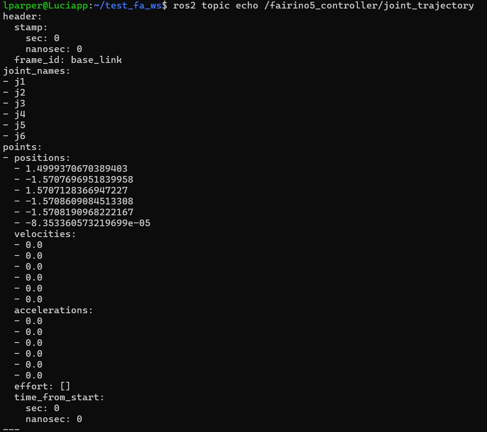

# ROS 2 MoveIt Examples for Fairino 5 V6

This repository contains practical examples and configurations for controlling the Fairino 5 V6 robot manipulator using ROS 2 and MoveIt 2. 

The examples demonstrate how to compute valid mathematical trajectories through MoveIt 2 and inject the resulting raw trajectory frames directly into the `ros2_control` hardware driver bus.

---

## Prerequisites

* **OS:** Ubuntu 22.04 LTS
* **ROS 2 Distribution:** Humble Hawksbill (Desktop-Full installation)
* **MoveIt 2**

Robot Drivers: The fairino5_controller or a valid simulation stack must be running and subscribing to /fairino5_controller/joint_trajectory.

Repository Structure
config/   → MoveIt configuration, kinematics, joint limits  
launch/   → Launch files for MoveIt and example execution nodes:
              • move_base.launch.py
              • move_single_joint.launch.py
              • move_pick_place.launch.py

media/    → Demonstration videos and screen recordings  

src/      → Example motion planning nodes:
              • move_base.cpp         → Base joint rotation profile (fairino_move_base)
              • move_single_joint.cpp → Safe single‑joint displacement (fairino_single_joint)
              • move_pick_place.cpp   → Cartesian pick‑and‑place routine (fairino_pick_place)
              
Installation & Building

1. Clone this repository into the src directory of your ROS 2 workspace:

mkdir -p ~/inlux_ws/src
cd ~/inlux_ws/src
git clone [https://github.com/inlux-robotics/ros2-examples.git](https://github.com/inlux-robotics/ros2-examples.git)

2. Install dependencies:

cd ~/inlux_ws
rosdep install --from-paths src --ignore-src -r -y

3. Build the workspace:

colcon build --symlink-install

4. Source the setup files:

source install/setup.bash

Running the Examples
Ensure your Fairino 5 simulation or hardware controller interface is actively running before executing any of the following nodes.
  ros2 launch fairino_mtc_demo mtc_demo_env.launch.py

1. Base Motion Profile (move_base.cpp)
Rotates the base joint (j1) to 1.5 rad, keeping the remaining joints in the default home posture.

  ros2 launch fairino5_v6_robot_moveit_config move_base.launch.py

<a href="ros2_ws_src/media/video3.mp4" target="_blank">
  <video src="ros2_ws_src/media/video3.mp4" width="450" alt="Example1">
</a>

2. Single Joint Safe Rotation (test_move.cpp)
Executes a safe rotation of 0.785 rad (45°) on the first joint.

  ros2 launch fairino5_v6_robot_moveit_config move_single_joint.launch.py

  <video src="media/v2.mp4" controls width="600"></video>

3. Pick and Place Sequence (mover_pick_place.cpp)
Runs a full Cartesian pick‑and‑place routine, including grasping and joint‑space transitions.

  ros2 launch fairino5_v6_robot_moveit_config move_pick_place.launch.py

<a href="[https://youtube.com/shorts/2tpM4zZSS9I](https://youtu.be/hNIOeZbGjUs
)" target="_blank">Video</a>

https://youtu.be/hNIOeZbGjUs

The resulting JointTrajectory message is published directly to:
/fairino5_controller/joint_trajectory

 ros2 topic echo /fairino5_controller/joint_trajectory

Contact & Support
Email: support@inluxrobotics.com
